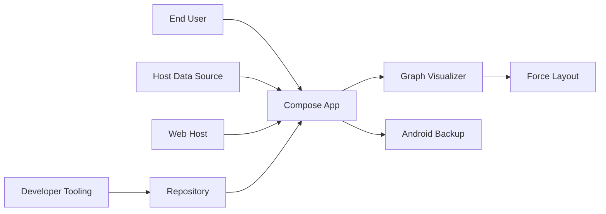

## Context confirmation (2026-02-18)
- 이 저장소는 샘플 앱 + 그래프 시각화 라이브러리이며, 보안 영향은 라이브러리 소비자 앱의 데이터 경로에 크게 의존합니다.
- `GraphVisualizer` 입력은 라이브러리 사용 개발자 구현에 따라 내부/외부 입력 모두 가능하므로, DoS 리스크는 조건부로 유지합니다 (`graph-visualizer/src/commonMain/kotlin/com/rootachieve/koraph/graphvisualizer/GraphVisualizer.kt:67`).
- 현재 샘플 앱은 계정/토큰/개인정보 저장 계획이 없으므로 백업 관련 위험은 낮은 우선순위로 조정합니다 (`composeApp/src/androidMain/AndroidManifest.xml:5`).
- 웹은 GitHub Pages 정적 배포 계획으로 확인되어, 웹 공급망 위험은 존재하나 샘플 성격을 반영해 우선순위를 낮게 조정합니다 (`composeApp/src/webMain/resources/index.html:18`).
- `firebase-debug.log`에는 실제 OAuth 토큰은 없고 scope 메타데이터만 존재합니다 (`firebase-debug.log:1`, `firebase-debug.log:7`).

## Executive summary
현재 컨텍스트에서 최고 위험군은 라이브러리 소비자가 외부/대용량 그래프를 무제한 입력할 때 발생할 수 있는 가용성 저하입니다. 샘플 앱 자체는 민감 데이터를 다루지 않으므로 백업 설정, 웹 정적 배포, 로그 메타데이터 이슈는 주로 운영 위생 관점의 낮은 우선순위 위험으로 재분류했습니다.

## Scope and assumptions
- In-scope paths:
  - `composeApp/`
  - `graph-visualizer/`
  - `gradle/`
  - `firebase-debug.log`
- Out-of-scope:
  - 외부 백엔드/API 서버 (저장소 내 미존재)
  - 인프라/클라우드 런타임 정책 (저장소 외부)
- Assumptions:
  - 앱은 멀티플랫폼 클라이언트 중심이며 서버 인증 계층이 없다.
  - 그래프 입력 신뢰수준은 라이브러리 소비자 구현에 따라 달라진다.
  - CI 파이프라인은 별도 구성되어 있으나 현재 저장소에서 직접 확인되지 않는다.
- Open questions that can change ranking:
  - 소비자 앱이 허용하는 입력 크기 상한(노드/간선 제한)
  - 소비자 앱이 민감 데이터를 저장하는지 여부
  - 소비자 웹 배포에서 CSP/무결성 정책을 어디서 강제하는지 여부

## System model
### Primary components
- `composeApp`: Android/iOS/JS/Wasm 앱 진입점 (`composeApp/src/androidMain/kotlin/com/rootachieve/koraph/MainActivity.kt`, `composeApp/src/webMain/kotlin/com/rootachieve/koraph/main.kt`)
- `graph-visualizer`: adjacency 입력을 렌더링하는 공용 라이브러리 (`graph-visualizer/src/commonMain/kotlin/com/rootachieve/koraph/graphvisualizer/GraphVisualizer.kt`)
- Force layout 엔진: 그래프 계산 핵심 루프 (`graph-visualizer/src/commonMain/kotlin/com/rootachieve/koraph/graphvisualizer/ForceLayoutEngine.kt`)
- Android 앱 매니페스트/빌드 설정 (`composeApp/src/androidMain/AndroidManifest.xml`, `composeApp/build.gradle.kts`)

### Data flows and trust boundaries
- End User -> App UI
  - Data: 탭/줌/팬 이벤트
  - Channel: 로컬 UI 이벤트
  - Security guarantees: 플랫폼 입력 모델 의존, 별도 인증 없음
  - Validation: 좌표 기반 hit-test만 수행 (`GraphVisualizer.kt:241`)
- Host App Data Source -> GraphVisualizer API
  - Data: `Map<K, List<K>>` adjacency, 노드 라벨
  - Channel: 인메모리 함수 호출
  - Security guarantees: 호출자 신뢰 가정
  - Validation: 구조 변환은 있으나 크기 제한 없음 (`GraphModel.kt:39`, `ForceLayoutEngine.kt:91`)
- App Runtime -> Android Backup channel
  - Data: 앱 로컬 저장 데이터(향후 포함 가능)
  - Channel: OS 백업/복원
  - Security guarantees: OS 정책 의존
  - Validation: 앱 차원 제한 없음 (`AndroidManifest.xml:5`)
- Browser/Web Host -> `composeApp.js`
  - Data: 스크립트 리소스
  - Channel: HTTP(S)
  - Security guarantees: 배포 인프라 설정 의존
  - Validation: CSP/SRI 표기 없음 (`index.html:18`)
- Developer tooling -> Repo logs
  - Data: Firebase CLI 디버그 로그
  - Channel: 파일 커밋/배포
  - Security guarantees: Git 운영 정책 의존
  - Validation: 현재 토큰은 없으나 scope 정보 존재 (`firebase-debug.log:1`)

#### Diagram

## Assets and security objectives
| Asset | Why it matters | Security objective (C/I/A) |
|---|---|---|
| 그래프 데이터(노드/간선) | 시각화 결과 무결성 및 앱 안정성에 직접 영향 | I, A |
| 앱 로컬 저장 데이터(미래 확장 포함) | 계정/설정/토큰 저장 시 유출 리스크 | C, I |
| 웹 배포 산출물(`composeApp.js`) | 변조 시 클라이언트 코드 실행권 획득 가능 | I |
| 소스 저장소/로그 파일 | 내부 운영정보 및 잠재 비밀 노출 경로 | C |
| UI 가용성(렌더링 프레임) | 대규모 입력 시 사용자 기능 마비 가능 | A |

## Attacker model
### Capabilities
- 공개 배포된 클라이언트 앱에 임의 입력(대형 그래프)을 전달할 수 있는 외부 사용자.
- 저장소를 읽을 수 있는 제3자(오픈소스 소비자 포함).
- 웹 호스팅/전달 경로를 노리는 공급망 공격자(배포 환경 약할 경우).

### Non-capabilities
- 저장소에 없는 백엔드 DB/관리자 API 직접 공격은 본 범위에서 불가.
- 운영체제 루트 권한 전제 공격은 기본 시나리오에서 제외(필요 시 별도 모델링).

## Entry points and attack surfaces
| Surface | How reached | Trust boundary | Notes | Evidence (repo path / symbol) |
|---|---|---|---|---|
| Android launcher activity | 앱 실행 | User -> App | 단일 exported 액티비티 | `composeApp/src/androidMain/AndroidManifest.xml:11` |
| Web bootstrap script | 브라우저 로딩 | Web Host -> App | CSP/SRI 명시 없음 | `composeApp/src/webMain/resources/index.html:18` |
| Graph input API | 라이브러리 호출 | Data Source -> Visualizer | 입력 크기 제한 부재 | `graph-visualizer/src/commonMain/kotlin/com/rootachieve/koraph/graphvisualizer/GraphVisualizer.kt:67` |
| Force layout loop | GraphVisualizer 내부 | Visualizer -> Compute engine | O(n^2 * iterations) 구조 | `graph-visualizer/src/commonMain/kotlin/com/rootachieve/koraph/graphvisualizer/ForceLayoutEngine.kt:91` |
| Android backup policy | OS 백업 수행 | App -> OS Backup | `allowBackup=true` | `composeApp/src/androidMain/AndroidManifest.xml:5` |
| Repo-tracked debug log | Git clone/공개 | Tooling -> Repository | OAuth scope 메타데이터 노출 | `firebase-debug.log:1` |

## Top abuse paths
1. 공격자 목표: 앱 가용성 저하
   1) 외부 입력 소스에 매우 큰 adjacency 주입
   2) `computeForceLayout` 이중 루프가 반복 수행
   3) UI 스레드/렌더링 지연으로 앱 사용 불가
2. 공격자 목표: 백업 경로를 통한 데이터 획득
   1) 사용자 단말 백업 데이터 접근 시도
   2) 앱 데이터가 백업 세트에 포함
   3) 민감정보 저장 시 기밀성 손상
3. 공격자 목표: 저장소 메타데이터 기반 정찰
   1) 커밋된 로그에서 인증 스코프/도구 사용 패턴 수집
   2) 사회공학/표적 공격 정교화
   3) 후속 자격증명 탈취 시도 확률 증가
4. 공격자 목표: 웹 산출물 변조를 통한 코드 실행
   1) 정적 파일 배포 경로/CDN 변조
   2) 브라우저가 변조된 `composeApp.js` 로딩
   3) 클라이언트 무결성 손상
5. 공격자 목표: 리버스엔지니어링 비용 절감
   1) release 난독화 비활성 APK 분석
   2) 내부 로직/상수 추적
   3) 앱 변조/복제 시도 비용 감소

## Threat model table
| Threat ID | Threat source | Prerequisites | Threat action | Impact | Impacted assets | Existing controls (evidence) | Gaps | Recommended mitigations | Detection ideas | Likelihood | Impact severity | Priority |
|---|---|---|---|---|---|---|---|---|---|---|---|---|
| TM-001 | 원격/외부 입력 공급자 | 그래프 데이터가 외부 입력과 연결되어야 함 | 대형/비정상 그래프로 레이아웃 계산량 폭증 유도 | 앱 프리즈/응답 지연 | UI 가용성, 그래프 데이터 무결성 | 최소 스케일/반경 보정 등 일부 안정화 (`GraphVisualizerApi.kt`, `ForceLayoutEngine.kt`) | 노드/간선/반복 상한, 타임아웃, 백그라운드 연산 제한 부재 | 노드/간선 최대치 검증, 초과 입력 거절, 계산을 백그라운드 디스패처로 이동, 작업 시간 제한 도입 | 프레임 타임/ANR 지표, 입력 크기 메트릭, 계산 시간 히스토그램 경보 | medium | medium | medium |
| TM-002 | 로컬 공격자 또는 백업 접근자 | 샘플 앱이 향후 민감 데이터 저장으로 확장되어야 함 | 백업 경로에서 앱 데이터 획득 | 데이터 유출 가능성(현재는 제한적) | 앱 로컬 저장 데이터 | 현재 샘플 앱은 민감 데이터를 저장하지 않음(사용자 확인) | `allowBackup=true` 기본값이 남아 있어 소비자/확장 시 재노출 가능 (`AndroidManifest.xml:5`) | 샘플에는 현상 유지 가능, 배포 앱/소비자 문서에 `allowBackup` 정책 가이드 명시 | 릴리즈 체크리스트에 백업정책 점검 추가 | low | low | low |
| TM-003 | 저장소 관찰자/공급망 정찰자 | 로그 파일이 버전관리로 배포되어야 함 | 로그에서 OAuth scope/운영 습관 수집 | 정찰 품질 향상(직접 침해는 아님) | 저장소 메타데이터 | 로그 내 실제 OAuth 토큰은 없음 (`firebase-debug.log:7`) | 로그 커밋 습관이 남아 재발 시 실제 비밀 노출 가능 | 로그 파일 저장소 추적 해제, pre-commit secret scan(gitleaks 등), CI 비밀탐지 | PR 단계 비밀 스캔 실패 알림, 로그 파일 커밋 감지 룰 | low | low | low |
| TM-004 | 웹 공급망 공격자 | GitHub Pages 정적 배포 경로가 공격받아야 함 | `composeApp.js` 변조 후 사용자에게 전달 | 샘플 웹 무결성 손상 | 웹 배포 산출물, 사용자 신뢰 | 단순 정적 로더만 존재 (`index.html:18`) | 저장소 내 CSP/SRI 가드레일 부재 | 가능하면 메타 CSP 추가, 배포 파이프라인에서 아티팩트 해시 검증 | 배포 후 해시 검증, 무결성 모니터링 | low | medium | low |
| TM-005 | 리버스엔지니어링 공격자 | APK 확보 가능(일반적) | 난독화 없는 release 바이너리 분석 | 공격 자동화/변조 비용 감소 | 앱 로직 무결성 | 최신 SDK 타겟 및 기본 플랫폼 보호 | `isMinifyEnabled=false` (`composeApp/build.gradle.kts:80`) | release에서 R8/난독화 활성화, 디버그 심볼 관리, 무결성 점검 | 변조 APK 탐지(서명 검증), 비정상 클라이언트 비율 모니터링 | high | low | low |

## Criticality calibration
- critical:
  - 인증 우회로 사용자 데이터 대량 탈취 가능 시
  - 서명 키/실제 토큰이 저장소에 노출된 경우
  - 원격 코드 실행 체인이 재현 가능한 경우
- high:
  - 공개 웹 배포에서 무결성 검증 부재 + 실제 변조 가능성이 높은 경우
  - 민감정보 저장 앱에서 백업 정책 오설정으로 대규모 유출 가능 시
  - 테넌트/사용자 간 데이터 경계 붕괴 시
- medium:
  - 가용성 저하가 재현 가능하나 복구가 가능한 경우(대형 그래프 DoS)
  - 운영 메타데이터 노출로 표적 공격 가능성이 증가하는 경우
  - 의존성 노후로 잠재 CVE 노출 가능성이 있으나 즉시 악용 경로 미확정인 경우
- low:
  - 보안 직접영향이 작고 주로 분석 난이도만 낮추는 설정(난독화 비활성)
  - UI/아이콘/빌드 경고 수준 이슈
  - 공격 전제조건이 비현실적으로 높은 경우

## Focus paths for security review
| Path | Why it matters | Related Threat IDs |
|---|---|---|
| `composeApp/src/androidMain/AndroidManifest.xml` | 백업 정책/컴포넌트 노출 등 플랫폼 보안 기본선 | TM-002 |
| `composeApp/build.gradle.kts` | release 보안 옵션(난독화/축소) | TM-005 |
| `composeApp/src/webMain/resources/index.html` | 웹 산출물 로딩 신뢰경계(CSP/SRI) | TM-004 |
| `graph-visualizer/src/commonMain/kotlin/com/rootachieve/koraph/graphvisualizer/GraphVisualizer.kt` | 외부 데이터 진입점 및 계산 트리거 | TM-001 |
| `graph-visualizer/src/commonMain/kotlin/com/rootachieve/koraph/graphvisualizer/ForceLayoutEngine.kt` | 계산 복잡도 기반 DoS 핵심 위치 | TM-001 |
| `firebase-debug.log` | 로그/메타데이터 노출 및 운영 위생 점검 | TM-003 |
| `gradle/libs.versions.toml` | 의존성 최신화 및 CVE 관리 출발점 | TM-003 |

## Quality check
- [x] 발견된 엔트리포인트(Android launcher, web bootstrap, graph input API)를 모두 다뤘습니다.
- [x] 각 신뢰경계를 위협 항목에 최소 1회 이상 연결했습니다.
- [x] 런타임 코드와 개발/도구 산출물(`firebase-debug.log`, Gradle 설정)을 분리해 기술했습니다.
- [x] 사용자 컨텍스트 답변(라이브러리 소비자 종속, 샘플앱 비민감, GitHub Pages 배포)을 우선순위에 반영했습니다.
- [x] 결론은 소비자 앱 맥락에 따라 조건부로 변할 수 있음을 표시했습니다.
